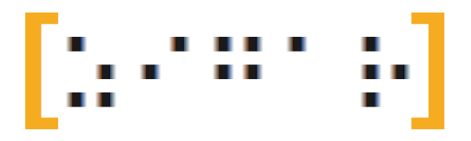

# Zigar

A software tool set that lets you utilize [Zig](https://ziglang.org/) code in your JavaScript
projects.

Consult the [project wiki](https://github.com/chung-leong/zigar/wiki) for installation instructions
and tutorials.

## Features

* Access to all Zig data types in JavaScript
* Zig-to-JavaScript, JavaScript-to-Zig call marshalling
* Async task management
* Threads in native code and WebAssembly
* Web stream handling
* Support for MacOS, Linux, and Windows (both 64-bit and 32-bit)
* Support for Node.js, Bun.js, Electron, and NW.js (native code execution)
* Support for Webpack, Rollup, and Vite (WebAssembly)

## Versioning

The major and minor version numbers of Zigar correspond to the version of the Zig compiler
it's designed for. The current version is 0.14.1. It works with Zig 0.14.0 and 0.14.1.

Note: Release of 0.14.2 is currently being prepared. It will become available in the coming days.

## Technical support

If you have questions concerning this project, please post them at this project's
[discussion section](https://github.com/chung-leong/zigar/discussions). I can also be contacted at
[ziggit.dev](https://ziggit.dev/), which also happens to be an excellent forum for finding help on
all matters related to the Zig language.
