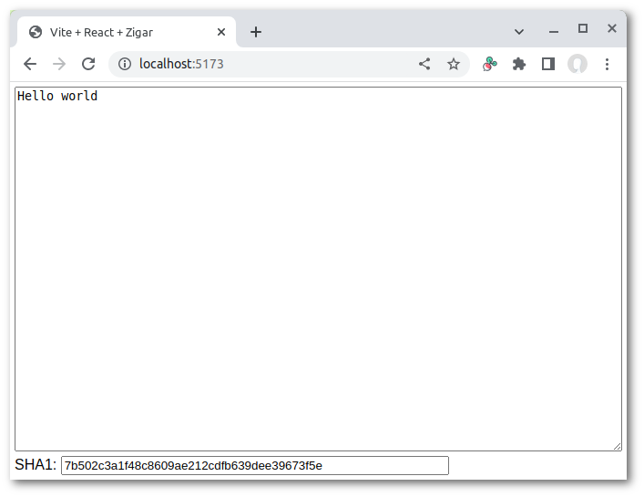

# rollup-plugin-zigar

Rollup plugin that lets you use code written in [the Zig language](https://ziglang.org/) in a
JavaScript project.

## Installation

```sh
npm install --save-dev rollup-plugin-zigar
```

You must install the Zig compiler onto your computer separately. Follow the instructions outlined
in the official [Getting Started](https://ziglang.org/learn/getting-started/) guide. Alternately,
you can let [ZVM](https://github.com/tristanisham/zvm) help manage the installation process.

This library assumes that the compiler is in the search path.

## Versioning

The major and minor version numbers of this plugin correspond to the version of the Zig compiler
it's designed for. The current version is 0.11.0. It works with Zig 0.11.0.

## Usage

Rollup configuration example:
```js
import Zigar from 'rollup-plugin-zigar';

export default {
  input: './sha1.zig',
  plugins: [
    Zigar({ useReadFile: true }),
  ],
  output: {
    file: './sha1.js',
    format: 'esm',
  },
};
```

Vite configuration example:
```js
import { defineConfig } from 'vite'
import React from '@vitejs/plugin-react-swc'
import Zigar from 'rollup-plugin-zigar';

export default defineConfig({
  plugins: [
    React(),
    Zigar({ topLevelAwait: false }),
  ],
})
```

## Options

* `optimize` - Optimization level (default: `ReleaseSmall` when building for production, `Debug`
otherwise)
* `topLevelAwait` - Use top-level await to wait for compilation of WASM code (default: `true`)
* `embedWASM` - Embed WASM binary as base64 in JavaScript code (default: `false`)
* `omitFunctions` - Exclude all functions and produce no WASM code (default: `false`)
* `stripWASM` - Remove extraneous code from WASM binary, including debugging information (default:
`true` unless `optimize` is `Debug`)
* `keepNames` - Keep names of function in WASM binary when stripping (default: `false`)
* `useReadFile` - Enable the use of readFile() to Load WASM file when library is used in Node.js
(default: `false`)
* `clean` - Remove temporary build folder after building (default: `false`)
* `zigCmd` - Zig build command (default: `zig build -Doptimize=${optimize}`)
* `cacheDir` - Directory where compiled shared libraries are placed (default: `${CWD}/zigar-cache`)
* `buildDir` - Root directory where temporary build folder are placed (default: `${os.tmpdir()}`)
* `staleTime` - Maximum amount of time to wait for a file lock, in milliseconds (default: `60000`)

## Awaiting WASM compilation

By default, the plugin uses top-level await to wait for compilation of WASM binary. As of writing,
this JavaSCript feature is not yet universally available. To produce a production build you might
need to set `topLevelAwait` to false.

There are two ways you can await WASM compilation when the feature is turned off. The first way is
to await the promise return by `__zigar.init()`:

```js
async function performTask(input) {
  const { calculate, __zigar } = await import('calculation.zig');
  await __zigar.init();
  const result = calculate(input);
  displayResult(result);
}
```

The second way is to use `await` on one of your own Zig functions:

```js
async function performTask(input) {
  const { calculate } = await import('calculation.zig');
  const result = await calculate(input);
  displayResult(result);
}
```

Prior to the completion of WASM compilation, every function will return a promise of its eventual
result.

## __zigar object

Every module exported by Zigar comes with a `__zigar` object. This object has two methods:

* `init()` - Return a promise that resolves when WASM compilation completes
* `abandon()` - Remove all references to the WebAssembly instance running the code so that it
can be garbage-collected

## Demo app

To demonstrate how to use this plugin, we'll build a simple React app that calculate the SHA-1 hash
of text you enter. We start by running the command `npm create vite@latest`. Select React as the
framework and JavaScript + SWC as the variant. Go into the directory and run `npm install`, then
`npm install --save rollup-plugin-zigar`.

Open `vite.config.js` in your code editor and add the plugin:

```js
import { defineConfig } from 'vite'
import React from '@vitejs/plugin-react-swc'
import Zigar from 'rollup-plugin-zigar'; // <-- importing plugin

export default defineConfig({
  plugins: [
    React(),
    Zigar(), // <-- using plugin
  ],
})
```

Replace the boilerplate code in `src/App.jsx` with the following:

```js
import { useState, useCallback } from 'react'
import { sha1 } from './sha1.zig'; // <-- importing Zig function
import './App.css'

function App() {
  const [ text, setText ] = useState('');
  const [ hash, setHash ] = useState('');
  const onChange = useCallback((evt) => {
    const { value } = evt.target;
    setText(value);
    const hash = sha1(value);
    setHash(hash.string);
  }, []);

  return (
    <div className="App">
      <textarea value={text} onChange={onChange} />
      <div className="Hash">
        SHA1: <input value={hash} readOnly={true} />
      </div>
    </div>
  );
}

export default App
```

And likewise for `src/App.css`:

```css
.App {
  display: flex;
  flex-direction: column;
  height: 100vh;
  width: 100vw;
  padding: 5px;
}

.App textarea {
  flex: 1 1 auto;
}

.App .Hash {
  flex: 0 0 auto;
  padding-top: 5px;
}

.App .Hash input {
  width: 32em;
}
```

And `src/index.css`:

```css
* {
  box-sizing: border-box;
}

body {
  margin: 0;
  font-family: Arial, Helvetica, sans-serif;
}
```

Then add `src/sha1.zig`, the file imported by `src/App.jsx`:

```zig
const std = @import("std");

pub fn sha1(bytes: []const u8) [std.crypto.hash.Sha1.digest_length * 2]u8 {
    var digest: [std.crypto.hash.Sha1.digest_length]u8 = undefined;
    std.crypto.hash.Sha1.hash(bytes, &digest, .{});
    return std.fmt.bytesToHex(digest, .lower);
}
```

`sha1()` returns an array object. We access its `string` property to get a string in our `onChange`
handler above.

In the command line, run `npm run dev`, then open the on-screen hyperlink with your browser. You
should be greeted by the following:



Enter some text into the text box. Its SHA-1 hash should appear at the bottom of the page.

Now switch back to your code editor and make the following change to `src/sha1.zig`:

```zig
const std = @import("std");

pub fn sha1(bytes: []const u8) [std.crypto.hash.Sha1.digest_length * 2]u8 {
    var digest: [std.crypto.hash.Sha1.digest_length]u8 = undefined;
    std.crypto.hash.Sha1.hash(bytes, &digest, .{});
    return std.fmt.bytesToHex(digest, .upper); // <-- requesting uppercase letters
}
```

When you return to the browser again, you should see that typing now produces upper-case hashes.

As of October 2023, you will encounter the following error when you run `npm run build`:

```
[vite:esbuild-transpile] Transform failed with 1 error:
assets/index-!~{001}~.js:3370:0: ERROR: Top-level await is not available in the configured target
environment ("chrome87", "edge88", "es2020", "firefox78", "safari14" + 2 overrides)

Top-level await is not available in the configured target environment ("chrome87", "edge88",
"es2020", "firefox78", "safari14" + 2 overrides)
```

In order to build successfully, we need to go back to `src/vite.config.js` and set `topLevelAwait`
to `false`:

```js
import { defineConfig } from 'vite'
import React from '@vitejs/plugin-react-swc'
import Zigar from 'rollup-plugin-zigar';

export default defineConfig({
  plugins: [
    React(),
    Zigar({ topLevelAwait: false }), // <-- disabling top-level-await
  ],
})
```

Without top-level await the app will work properly most of the time. In theory the loading process
could hit a hiccup and `sha1()` ends up being called before it's ready. To ensure that our app
works right all the time we're going to add a check to the `onChange` handler:

```js
import { useState, useCallback } from 'react'
import { sha1 } from './sha1.zig';
import './App.css'

function App() {
  const [ text, setText ] = useState('');
  const [ hash, setHash ] = useState('');
  const onChange = useCallback((evt) => {
    const { value } = evt.target;
    setText(value);
    const hash = sha1(value);
    if (hash instanceof Promise) {  // <-- check for promise
      hash.then(hash => setHash(hash.string));
    } else {
      setHash(hash.string);
    }
  }, []);

  return (
    <div className="App">
      <textarea value={text} onChange={onChange} />
      <div className="Hash">
        SHA1: <input value={hash} readOnly={true} />
      </div>
    </div>
  );
}

export default App
```

You can see the demo in action [here](https://chung-leong.github.io/zigar/demo-1/).

## Additional information

Consult the [Zigar runtime](../zigar-runtime/README.md) user guide to learn more about working
with Zig data structures in JavaScript.
